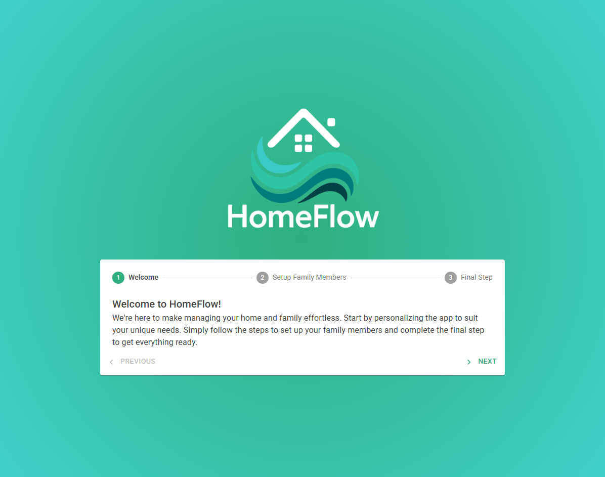
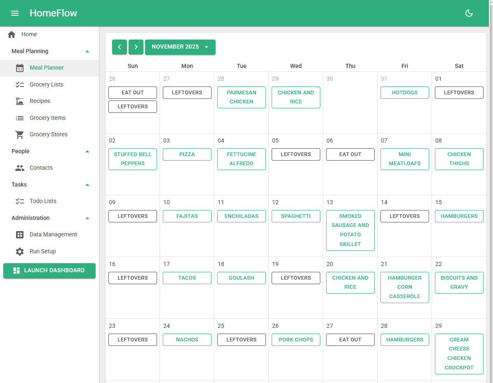
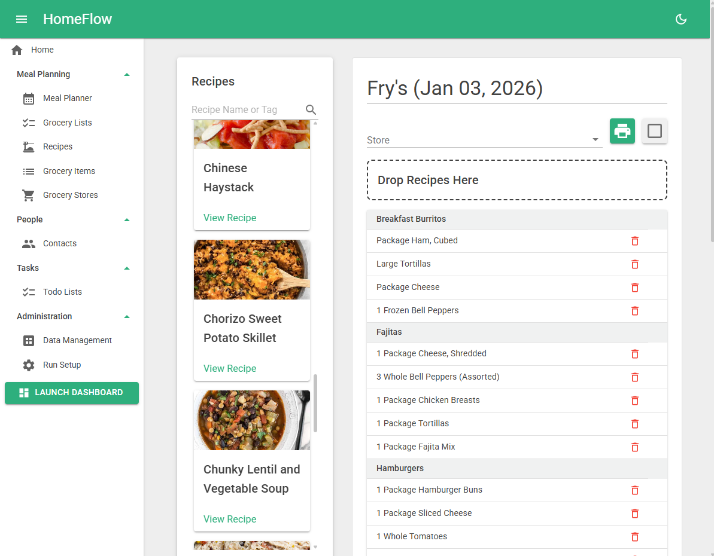
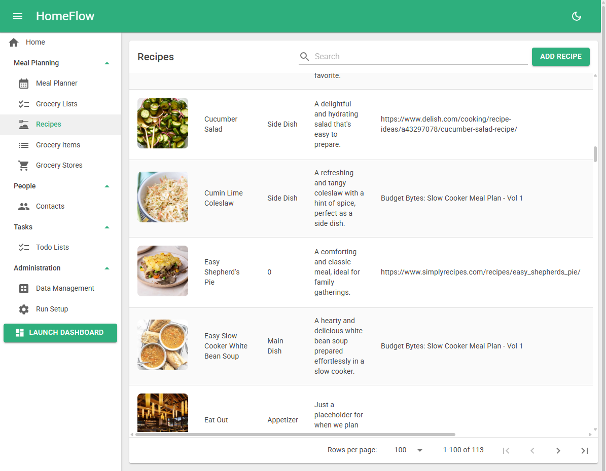
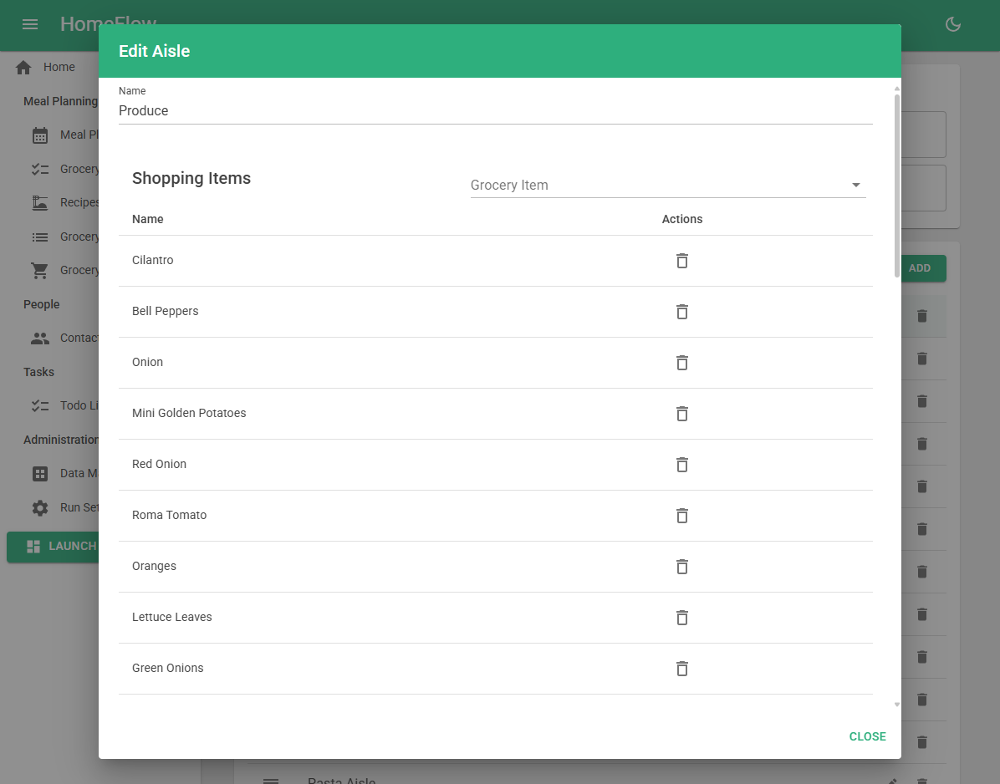

# HomeFlow

**HomeFlow** is a Blazor Server application designed to help individuals and families organize everyday home life. From managing recipes and planning meals to building grocery lists, HomeFlow provides a streamlined, customizable platform for staying on top of it all.

---

## Features

- **Recipe Management**  
  Store, edit, and tag your favorite recipes with ingredients, steps, and photos.

- **Drag & Drop Grocery List Editor**  
  Create and organize grocery lists with an intuitive drag-and-drop interface.

- **Meal Planning**  
  Plan meals for the week and connect them to your grocery workflow.

- **Tagging System**  
  Flexible tagging for recipes, ingredients, and more.

- **Docker Support**  
  Easily run the full stack using Docker for simplified deployment and testing.

---

## Screenshots

---

## Tech Stack

- **Frontend**: Blazor WebAssembly (.NET 8), MudBlazor  
- **Backend**: ASP.NET Core API  
- **Database**: SQLite, EF Core  
- **Architecture**: Vertical Slice Architecture  
- **Containerization**: Docker, Docker Compose
